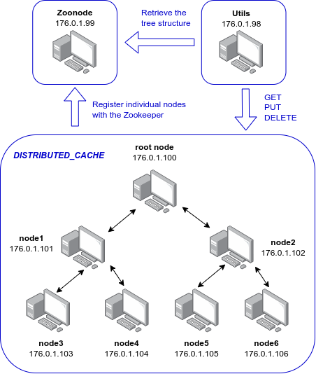

# KIV/DS - Distributed Cache



The goal of this assignment was to implement a distributed cache. The cache is made up of several nodes connected in a binary tree structure. The depth of the tree is defined prior to starting up the containers. Each of the nodes holds its own key-value storage. There are three operations that can be performed on any node.

* `GET <ip> <key>` - Returns the value that is stored with the given key.
    * If the node holds no such record, it recursively tries to retrieve the data from its parent, leaving the caller temporarily blocked.
    * The look-up does not go beyond the root node.
    * If the matching record is found on the way up the tree structure, all nodes involved in the process get to update their local storage on the way down.
* `PUT <ip> <key> <value>` - Stores the given key-value pair.
    * The node also sends the update toward the root node, so the nodes can update their local storage as well.
* `DELETE <ip> <key>` - Deletes the value that is stored with the given key.
    * Just like the `PUT` method, it propagates the update up the tree structure.

Each node knows the IP address of the root node (it is passed into the container as an environment variable). Once a node starts up, it connects to the root node to retrieve the IP address of its parent node. After, that it registers with the Zookeeper, where the entire structure is visualized. 

## Utils

There was an additional node added into the system that contains a few utility scripts to test out different kinds of functionality. The user can connect to it by executing the following command

```
docker exec -it node-utils /bin/bash
```

Once the user is connected to the container, they can navigate to the folder containing all the utility scripts by executing the following command.

```
cd /opt/utils/python/
```

There are two utility scripts in total.
```
[root@zoonode python]# ls -l
total 12
-rw-rw-r-- 1 root root 1126 Dec 18 19:41 cache_client.py
-rw-rw-r-- 1 root root   58 Dec 17 18:25 requirements.txt
-rw-rw-r-- 1 root root  754 Dec 18 19:42 tree_structure.py
[root@zoonode python]#
```

### `tree_structure.py`

This script verifies that the nodes are indeed connected in the desired tree structure. The user can run the script like so.

```
python3 tree_structure.py
```

Behind the scenes, the script connects to the zookeeper node whose IP address is retrieved from the environment variables. Using a DFS algorithm, it asks the zoonode for all paths it holds.

An output of the script may look something like this.

```
[root@zoonode python]# python3 tree_structure.py
path: /
path: //176.0.1.100
path: //176.0.1.100/176.0.1.102
path: //176.0.1.100/176.0.1.102/176.0.1.106
path: //176.0.1.100/176.0.1.102/176.0.1.105
path: //176.0.1.100/176.0.1.101
path: //176.0.1.100/176.0.1.101/176.0.1.103
path: //176.0.1.100/176.0.1.101/176.0.1.104
path: //zookeeper
path: //zookeeper/quota
path: //zookeeper/config
[root@zoonode python]# 
```

#### Zoonavigator

The user can also use Zoonavigator to view the structure of the cache. All they have to do is to type the following command to start the container.

```
docker run -d --network host -e HTTP_PORT=9000 --name zoonavigator --restart unless-stopped elkozmon/zoonavigator:latest
```
Once the container has started, they can navigate to http://localhost:9000/` where they enter the IP address of the zoonode (176.0.1.99).

### `cache_client.py`