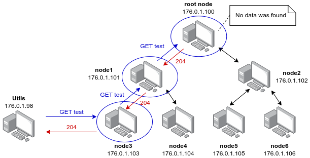
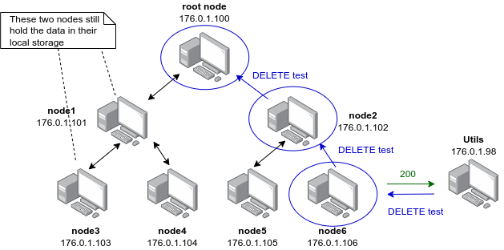
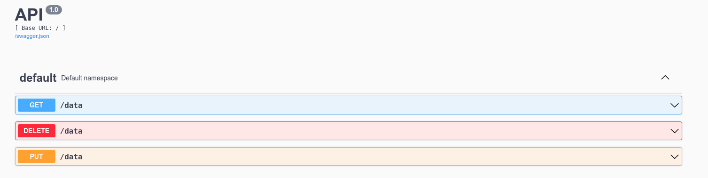

# KIV/DS - Distributed Cache


The goal of this assignment was to implement a distributed cache. The cache is made up of several nodes connected in a binary tree structure. The depth of the tree is defined prior to starting up the containers. Each node holds its own key-value storage. There are three operations that can be performed on any node.

* `GET <ip> <key>` - Returns the value that is stored with the given key.
    * If the node finds no such record in its local storage, it recursively tries to retrieve the data from its parent, leaving the caller temporarily blocked.
    * The look-up does not go beyond the root node.
    * If a matching record is found on the way up the tree structure, all nodes involved in the process get to update their local storage on the way down.
* `PUT <ip> <key> <value>` - Stores the given key-value pair.
    * The node also sends the update toward the root node, so the nodes can update their local storage as well.
    * The caller does not get blocked.
* `DELETE <ip> <key>` - Deletes the value that is stored with the given key.
    * Just like the `PUT` method, it propagates the update up the tree structure.

Each node knows the IP address of the root node as it is passed into the container as an environment variable. Once a node starts up, it connects to the root node to retrieve the IP address of its parent node. Finally, it registers with the Zookeeper, where the entire structure is visualized. 

## Settings

The user can adjust the depth of the tree structure by changing the `TREE_DEPTH_LEVEL` variable located in the Vagrantfile on line 14.

```
TREE_DEPTH_LEVEL = 3
```

Similarly, they can change the index of the root node by changing line 28 in the same file.

```
ROOT_NODE_IDX = 0
```
It important to highlight that this value must not exceed the total number of nodes - 1. For example, if the depth of the tree is 3, then the maximum allowed index of the root node is 6.

## Starting up containers

To start all containers that make up the application, all the user has to do is to type the following command in the root folder of the project structure.

```
vagrant up
```

To shut down the containers, they can use the following command.

```
vagrant destroy -f
```

## Utils

There was an additional node added into the system that contains a few utility scripts to test out different kinds of functionality of the system. The user can connect to it by executing the following command.

```
docker exec -it node-utils /bin/bash
```

Once the user is connected to the container, they can navigate to the folder containing all the utility scripts by executing the following command.

```
cd /opt/utils/python/
```

There are two utility scripts in total.
```
[root@zoonode python]# ls -l
total 12
-rw-rw-r-- 1 root root 1126 Dec 18 19:41 cache_client.py
-rw-rw-r-- 1 root root   58 Dec 17 18:25 requirements.txt
-rw-rw-r-- 1 root root  754 Dec 18 19:42 tree_structure.py
[root@zoonode python]#
```

### `tree_structure.py`

This script verifies that the nodes are indeed connected in the desired tree structure. The user can run the script like so.

```
python3 tree_structure.py
```

Behind the scenes, the script connects to the zoonode whose IP address is retrieved from the environment variables, and using a DFS algorithm, it asks it for all paths it knows of.

An output of the script may look something like this.

```
[root@zoonode python]# python3 tree_structure.py
path: /
path: /176.0.1.100
path: /176.0.1.100/176.0.1.102
path: /176.0.1.100/176.0.1.102/176.0.1.106
path: /176.0.1.100/176.0.1.102/176.0.1.105
path: /176.0.1.100/176.0.1.101
path: /176.0.1.100/176.0.1.101/176.0.1.103
path: /176.0.1.100/176.0.1.101/176.0.1.104
path: /zookeeper
path: /zookeeper/quota
path: /zookeeper/config
[root@zoonode python]# 
```

#### Zoonavigator

The user can also use Zoonavigator to view the structure of the cache. All they have to do is to type the following command to start the container.

```
docker run -d --network host -e HTTP_PORT=9000 --name zoonavigator --restart unless-stopped elkozmon/zoonavigator:latest
```
Once the container has started, they can navigate to http://localhost:9000/ where they enter the IP address of the zoonode - 176.0.1.99.

### `cache_client.py`

The cache client allows the user to perform different data-related operations on individual nodes.

#### GET

```
python3 cache_client.py 176.0.1.103 get test
```

The output of this command looks as follows.

```
status_code: 204
data: 
```
The status code indicates that no such record was found in the cache, at least on the way up to the root node.



#### PUT

```
python3 cache_client.py 176.0.1.106 put test "Howdy, how's it going?"
```

If all went well, the user receives a message saying that the data has been stored successfully. As mentioned previously, it propagates the update up the tree structure.
```
status_code: 200
data: "The value was successfully stored in the cache"
```


If we now try to execute the previous GET command, we get the following answer as the data is now known to the root node.

```
python3 cache_client.py 176.0.1.103 get test
```

```
status_code: 200
data: "Howdy, how's it going?"
```


#### DELETE

The DELETE operation works in the similar fashion as the PUT operation. Once the data is deleted from the local storage, the update is propagated up the tree structure.

```
python3 cache_client.py 176.0.1.106 delete test
```

The user is notified about the result through the following message.

```
status_code: 200
data: "Data was successfully deleted from the cache"
```

However, if we send the get request to node `176.0.1.103` again, we still receive the data as the information about the data being deleted does not traverse down the other tree branch.



## Open API

Another way to interact with the nodes is to use the interface that comes with each node. For example, the web interface of node 1 can be accessed via http://176.0.1.101:5000/. It provides the same methods for data manipulation as the `cache_client.py` script.



## Cache coherence

As you might have noticed, with each PUT or DELETE operation, the cache gets updated up towards the root node. Therefore, some nodes may still have old information in their local storage. The only node that has consistent data all the time is the root node itself. There are a few possible ways to deal with this issue, all of which have their proc & cons.

### Approach #1

Since the root node keeps the entire structure of the cache in memory, it could periodically broadcast changes to all the other nodes. Every record would be stored with a timestamp. If a node receives an update from the root node, it compares it to its local record and depending on its timestamp, it would either update it or discard it. The issue with this approach is that it puts additional stress on the root node, which already represents a bottle neck of the system.

### Approach #2

